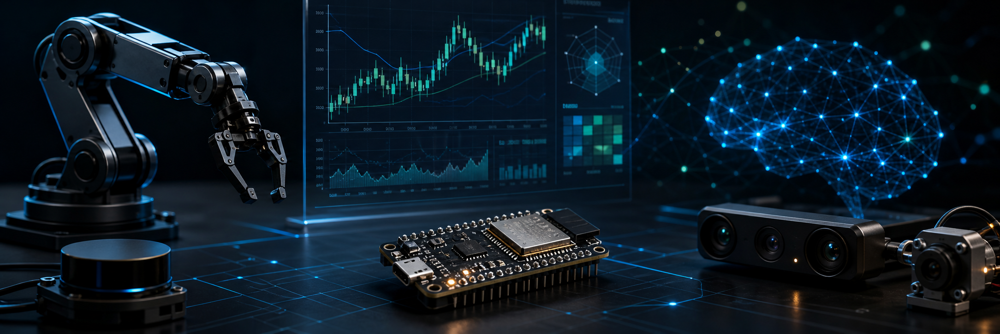

<div align="center">



# Ruoxiang Zhao

**Mechanical engineer building robotics, embedded systems, and practical AI tools.**

Incoming M.S. Robotics student at the University of Michigan. RPI Mechanical Engineering '26. I like projects where software has to meet the physical world: autonomous vehicles, sensor systems, firmware, and AI workflows with real safety boundaries.

<a href="https://zhaor3.github.io/portfolio/"></a>
<a href="https://github.com/Zhaor3/signalforge-ai"></a>
<a href="https://github.com/Zhaor3/tokenjar"></a>

</div>

## What I Build

- **Robotics and autonomous systems** - ROS 2, vehicle dynamics, controls, sensors, CAD, rapid prototyping.
- **Embedded hardware products** - ESP32-S3, C++, PlatformIO, LVGL, SPI displays, rotary UI, WiFi provisioning, OTA.
- **AI + backend systems** - Python, FastAPI, SQLAlchemy, Redis, testable service layers, model routing, agent workflows.
- **Safety-aware tools** - deterministic checks around AI output, explicit failure modes, risk gates, and human confirmation.

Right now I am especially interested in embodied AI, autonomous vehicles, and AI systems that stay useful when the data is messy and the hardware is real.

## Best Recent Repo: SignalForge AI

<a href="https://github.com/Zhaor3/signalforge-ai">
  
</a>

**[signalforge-ai](https://github.com/Zhaor3/signalforge-ai)** is the repo I would send a recruiter to first.

It is a safety-aware quant + AI Telegram research assistant that scans markets, tracks portfolios, calculates deterministic risk, paper trades, backtests strategies, and explains trade setups without executing real orders.

Why it is the strongest showcase:

- **Real architecture:** FastAPI/Telegram entry points, service layer, provider abstractions, quant modules, risk modules, AI modules, SQLAlchemy persistence, Redis cache support.
- **Clear safety boundary:** Python calculates indicators, PnL, sizing, and risk; AI explains summaries but cannot override deterministic risk decisions.
- **Test coverage:** repo includes tests for trading plans, parsers, Telegram handlers, indicators, backtesting, risk sizing, portfolio services, scanners, and AI routing.
- **Product thinking:** natural-language Telegram flows like daily checks, risk checks, watchlists, paper trades, and beginner-friendly explanations.
- **Good README discipline:** architecture diagrams, setup instructions, testing commands, safety model, limitations, and roadmap are already documented.

Tech: `Python` `FastAPI` `SQLAlchemy` `Redis` `APScheduler` `pandas` `yfinance` `OpenAI` `Telegram Bot API` `pytest`

## Other Work Worth Opening

### [tokenjar](https://github.com/Zhaor3/tokenjar) - ESP32 API Usage Gadget

A real ESP32-S3 desk gadget that tracks Anthropic/OpenAI API usage with a 2-inch LCD, encoder UI, captive portal setup, cached data, OTA updates, and a printable case.

`C++` `PlatformIO` `LVGL` `TFT_eSPI` `ESP32-S3`

### [DayTradeAgents](https://github.com/Zhaor3/DayTradeAgents) - Multi-Agent Trading Research

Earlier multi-agent trading framework: 11 LLM agents, 6-phase debate pipeline, technical indicators, Telegram delivery, chart generation, and position-aware analysis.

`Python` `OpenAI/Anthropic` `yfinance` `Telegram`

### [portfolio](https://github.com/Zhaor3/portfolio) - Robotics Portfolio

Personal portfolio with robotics, vehicle controls, mechanical design, autonomous systems, and maker projects in one polished site.

`TypeScript` `Next.js` `Tailwind`

### [GeoAgent](https://github.com/Zhaor3/GeoAgent) - Image Geolocation Pipeline

Image-geolocation pipeline using EXIF, visual reasoning, hypothesis generation, external verification, and final scoring.

`Python` `Vision AI` `Telegram`

## Engineering Snapshot

```text
mechanical design -> sensors -> firmware -> data pipeline -> AI reasoning -> user workflow
```

I am comfortable moving across that whole path: designing parts in CAD, wiring sensors, writing embedded UI code, building Python services, and shaping the final user experience so the system is actually usable.

## Tools I Reach For

<p>
  
  
  
  
  
  
  
  
  
  
</p>

## Quick Context

- Incoming **M.S. Robotics** student at the University of Michigan.
- Completing **B.S. Mechanical Engineering** at RPI, GPA 3.87 / 4.0.
- Undergraduate researcher at **XAL Research Lab**, working on autonomous-vehicle systems for a Can-Am X3 platform.
- Tesla engineering intern in 2025, focused on CAD redesign, thermal/manufacturing assessment, and autonomous-driving sensor mounting.
- Seeking **Summer 2026 robotics, autonomous systems, controls, embedded, or AI engineering internships**.

## GitHub Signal

<div align="center">


</div>
