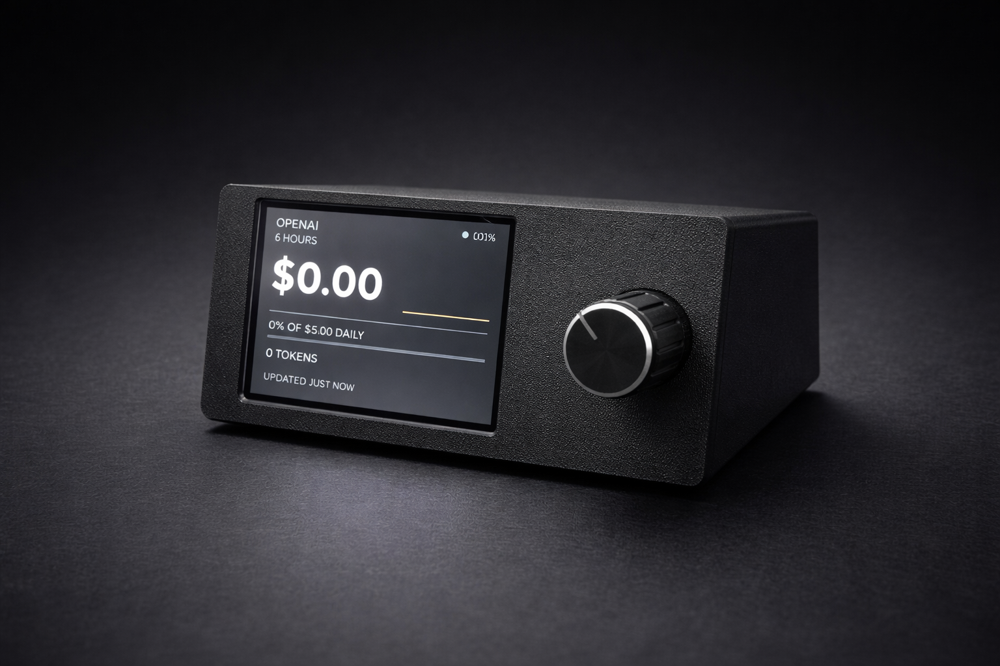
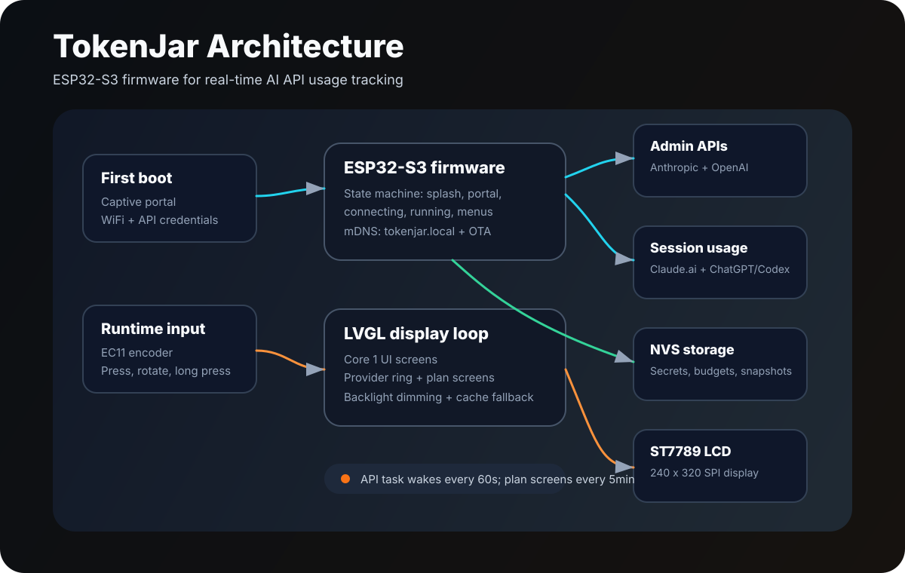
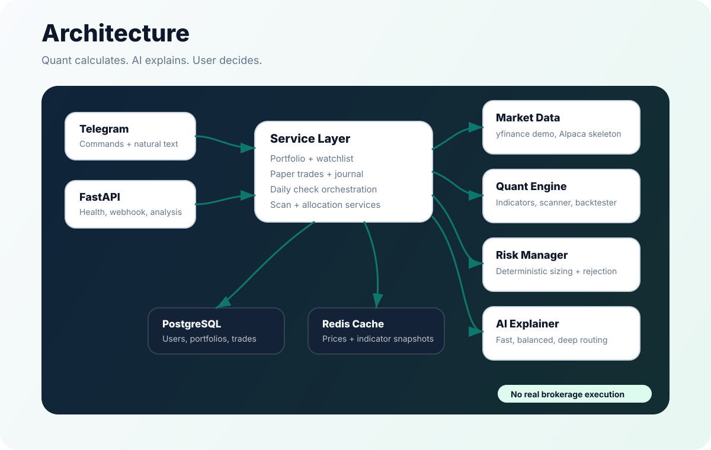

# Ruoxiang Zhao

**Mechanical engineer building robotics, embedded hardware, and practical AI systems.**

RPI Mechanical Engineering '26. Incoming M.S. Robotics student at the University of Michigan. I like systems where software has to touch real constraints: sensors, firmware, vehicles, market data, risk rules, and user workflows that need to work without hand-waving.

## What I Build

- **Embedded products:** ESP32-S3 firmware, PlatformIO, LVGL, SPI displays, rotary input, WiFi provisioning, OTA, and persistent device state.
- **Robotics and autonomous systems:** ROS 2, vehicle dynamics, controls, sensors, CAD, 3D printing, and lab-scale hardware integration.
- **AI + backend systems:** Python services, FastAPI, SQLAlchemy, Redis, tests, model routing, Telegram workflows, and provider abstractions.
- **Safety-aware tools:** deterministic checks around AI output, explicit failure modes, risk gates, cache fallbacks, and human confirmation.

## Featured Builds

### [TokenJar](https://github.com/Zhaor3/tokenjar) - ESP32-S3 AI Usage Gadget

TokenJar is a small desk device that shows Anthropic and OpenAI usage without opening a browser tab. It combines a 2-inch ST7789 LCD, an ESP32-S3 SuperMini, an EC11 rotary encoder, a 3D-printable enclosure, and firmware that talks to multiple usage sources.

What it shows technically:

- **Real embedded product loop:** hardware, firmware, UI, enclosure, setup flow, and troubleshooting are all documented.
- **Split runtime architecture:** main loop drives LVGL and encoder interactions while a FreeRTOS API task refreshes provider data.
- **Provider integration:** Anthropic Admin API, OpenAI Admin API, Claude.ai session usage, and ChatGPT/Codex usage paths can be configured independently.
- **Device reliability:** NVS-persisted credentials, cached snapshots, WiFi reconnect handling, mDNS as `tokenjar.local`, OTA updates, idle dimming, and runtime settings portal.

`C++` `PlatformIO` `LVGL` `TFT_eSPI` `ArduinoJson` `ESP32-S3` `FreeRTOS-style tasking`

### [SignalForge AI](https://github.com/Zhaor3/signalforge-ai) - Safety-Aware Quant + AI Assistant

SignalForge AI is a Telegram-first market research assistant. The important design choice is separation of responsibility: Python calculates indicators, portfolio state, paper-trade sizing, and deterministic risk; AI explains results and routes intent, but does not override the risk manager or execute real orders.

What it shows technically:

- **Layered backend:** Telegram and FastAPI entry points, service layer, quant modules, risk modules, AI modules, SQLAlchemy persistence, and Redis cache support.
- **Deterministic risk controls:** stop-loss, thesis, allocation, account-risk, single-stock exposure, margin, shorting, options, and penny-stock rules reject unsafe paper trades before persistence.
- **Provider abstractions:** yfinance demo provider today, with Alpaca/Polygon/Finnhub/Tiingo-style production provider boundaries already reflected in the architecture.
- **Testable workflow:** tests cover Telegram parsing/handlers, indicators, scanner behavior, backtesting, risk sizing, portfolio services, allocation, and AI model routing.

`Python` `FastAPI` `SQLAlchemy` `Redis` `APScheduler` `pandas` `yfinance` `OpenAI` `Telegram Bot API` `pytest`

## Other Work

### [DayTradeAgents](https://github.com/Zhaor3/DayTradeAgents) - Multi-Agent Trading Research

An earlier multi-agent research framework with 11 LLM agents, a 6-phase debate pipeline, local technical indicators, risk debate, chart generation, and Telegram delivery.

`Python` `OpenAI/Anthropic` `yfinance` `Telegram`

### [GeoAgent](https://github.com/Zhaor3/GeoAgent) - Image Geolocation Pipeline

Photo geolocation pipeline using EXIF extraction, visual reasoning, hypothesis generation, external verification, final scoring, CLI usage, and Telegram bot workflow.

`Python` `Vision AI` `Reasoning` `Telegram`

### [portfolio](https://github.com/Zhaor3/portfolio) - Robotics Portfolio

Personal portfolio with robotics, vehicle controls, mechanical design, autonomous systems, capstone work, maker projects, and project photography.

`TypeScript` `Next.js` `Tailwind` `Robotics`

## Engineering Through-Line

**Mechanical design -> sensors -> firmware -> data pipeline -> AI reasoning -> usable product**

I am comfortable moving across that path: designing parts in CAD, wiring sensors, writing embedded UI code, building Python services, and shaping the final user experience so the system is not just clever, but usable.

## Tools I Reach For

  
  
  
  
  
  
  
  
  

## Quick Context

- Incoming **M.S. Robotics** student at the University of Michigan.
- Completing **B.S. Mechanical Engineering** at RPI, GPA 3.87 / 4.0.
- Undergraduate researcher at **XAL Research Lab**, working on autonomous-vehicle systems for a Can-Am X3 platform.
- Tesla engineering intern in 2025, focused on CAD redesign, thermal/manufacturing assessment, and autonomous-driving sensor mounting.
- Seeking **Summer 2026 robotics, autonomous systems, controls, embedded, hardware, or AI engineering internships**.
